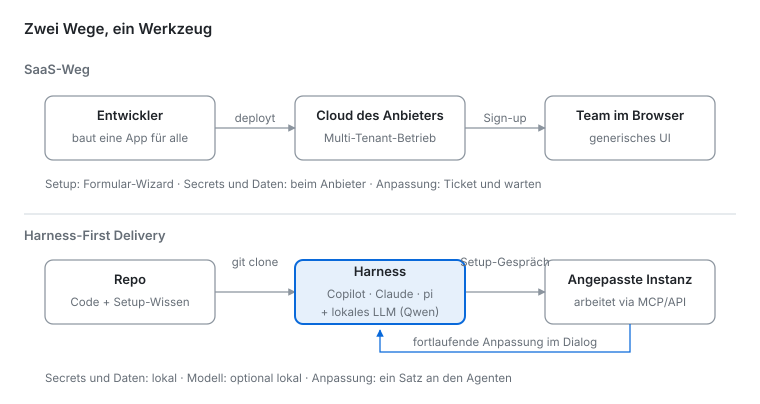

# Fachware – ein Muster für Fachwerkzeuge

Sebastian Dittmann · September 2026 · Lizenz: [CC BY 4.0](../LICENSE-docs)

_Fachware ist der Name des Musters; harness-first ausgeliefert ist der Mechanismus: ein Repo, das in einem Coding-Harness im Gespräch installiert und betrieben wird._

## Die Kernidee

Harnesses – Claude Desktop, GitHub Copilot, pi und Verwandte – werden für hochgradig individualisierte Fachapplikationen das, was der App Store für Apps war: der Kanal, der eine ganze Softwareklasse vom Sonderfall zur Selbstverständlichkeit macht. Nur ist das Regal diesmal ein Git-Repository, das explizit für die Nutzung im Harness gebaut ist – und der Installateur ist ein Gespräch.

Die Installation folgt keiner Konfigurationsanleitung. Sie ist ein Gespräch in natürlicher Sprache – getippt oder gesprochen – und zwar ein rein fachliches: »Wo liegt bei euch das Regelwerk, gegen das geprüft werden soll? Aus welchem System kommt der Ist-Stand?« Der Agent schaut selbst nach, schreibt die Konfiguration und passt sie im selben Dialog fortlaufend weiter an. Secrets bleiben auf der Maschine, das Modell kann lokal laufen.

Adressiert sind Fachleute – Methodiker, Coaches, Domänenexperten –, die typischerweise nicht vibe-coden oder dabei zu viel Unsicherheit erleben, und deren Werkzeuge trotzdem weder einen Server noch IT-Ressourcen binden sollen. Fachware sitzt damit genau zwischen SaaS (fertig, aber generisch) und Vibe-Coding (individuell, aber selbst gebaut): fertig gebaute Software, die sich im Fachgespräch selbst anpasst.

Die Idee ist kein einzelnes Werkzeug, sondern ein Auslieferungsmodell. These, Zuspitzung und Begriff stammen von mir (September 2026); die zitierten Quellen dienen der Einordnung, nicht als Ursprung.

## Das Muster: vier Verschiebungen

Das Modell lässt sich auf vier Verschiebungen gegenüber SaaS reduzieren:

- **Distribution: Repo statt Cloud-Instanz.** `git clone` ersetzt Sign-up und Deployment. Das Repo enthält neben dem Code maschinenlesbare Absicht (README, AGENTS.md, SKILL.md), die das Harness interpretiert.
- **Installation: Gespräch statt Wizard.** Kein Formular »Server-URL eintragen«, sondern ein Agent, der fragt, in den Zielsystemen nachschaut, Kandidaten vorschlägt und die Konfiguration selbst schreibt. Generalisierung wird durch Intelligenz ersetzt.
- **Betrieb: lokale Vertrauensgrenze.** Secrets – die API-Tokens der Fachsysteme – bleiben auf der Maschine, Daten fließen nicht durch die Server eines Anbieters. Optional läuft auch das Modell selbst lokal.
- **Wartung: Konfiguration als fortlaufender Dialog.** »Bei uns hat sich der Prozess geändert« ist kein Support-Ticket mehr, sondern ein Satz an den Agenten, der die Anpassung vornimmt. Die Anpassungsintelligenz reist im Repo mit.

Die Software ist damit nie »fertig konfiguriert«, sondern steht in einer dauerhaften Beziehung zu ihrer Umgebung – vermittelt durch das Harness.

## Das Muster im Bild

Oben endet jede Anpassung beim Anbieter; unten bleibt sie – wie Secrets und Daten – auf der eigenen Maschine: Das Repo ist das Produkt, das Harness die Runtime.

## Was gerade konvergiert (2024–2026)

Die These trifft einen Moment, in dem mehrere unabhängige Entwicklungen auf genau dieses Modell zulaufen:

- **Agent Skills / SKILL.md.** Im Oktober 2025 als Claude-Code-Feature gestartet, seit Dezember 2025 [offene Spezifikation](https://agentskills.io/home): ein Ordner mit Markdown-Anleitung plus optionalen Skripten, den ein Agent liest und ausführt. Binnen 48 Stunden von Microsoft und OpenAI übernommen, bis März 2026 [32 Tools](https://www.paperclipped.de/en/blog/agent-skills-open-standard-interoperability/), rund 90.000 Skills auf Vercels skills.sh. Das ist exakt »Setup- und Betriebswissen als Teil des Repos« – als Standard formalisiert.
- **AGENTS.md.** Ein [offenes Format](https://agents.md/) als »README für Agenten«, getragen u. a. von OpenAI. Zehntausende Repos beschreiben sich inzwischen für maschinelle Leser – Repos werden adressierbar für Harnesses.
- **MCP.** Das [Model Context Protocol](https://modelcontextprotocol.io) (Anthropic, Ende 2024) wurde 2025 von OpenAI und Google übernommen und ist de facto Standard für Tool-Anbindung, inklusive offizieller Server der großen SaaS-Anbieter. Die »Treiberschicht« für harness-native Software existiert bereits.
- **Harnesses werden Plattformen.** Claude Code hat [Plugins und Marketplaces](https://code.claude.com/docs/en/discover-plugins), Copilot und Gemini CLI haben Extensions. Der CLI-Agent wird zur Runtime mit eigenem Ökosystem – die Rolle, die früher Betriebssystem oder Browser hatten.
- **Spec-Driven Development.** Seit 2025 ein benanntes Feld ([GitHub Spec Kit](https://github.com/github/spec-kit), Amazon Kiro, OpenSpec, BMAD-METHOD): die Spezifikation als führendes Artefakt, aus dem Agenten Software bauen. Der Drei-Phasen-Lebenszyklus hier ist strukturell verwandt – mit zwei Unterschieden: SDD adressiert Entwickler, die Features bauen, und hält die Spezifikation dauerhaft im Fluss; Fachware adressiert Fachleute, die ein Werkzeug bekommen, das nach der Einrichtung einfriert.
- **Karpathy: Software 3.0.** [»Software is changing (again)«](https://ikyle.me/blog/2025/andrej-karpathy-software-is-changing-again) (Juni 2025): Prompts in natürlicher Sprache sind Programme, das LLM ist ein neuer Computer. Ein AGENTS.md oder SKILL.md ist genau das – versionierter Programmtext für den Agenten.

## Was ist neu

Repos klonen und lokal laufen lassen ist Open Source seit dreißig Jahren, interaktive Setups gab es als Wizards und Generatoren. Neu ist also keine einzige Zutat, sondern die Kombination – vier Punkte:

1. **Einrichtung und Pflege.** Self-Hosting scheiterte fast immer genau daran. Wenn Installation und Erweiterung ein Gespräch mit einem Harness werden, ändert sich das.
2. **Konfiguration wird von Zustand zu Prozess.** Nicht »settings.yaml einmal richtig ausfüllen«, sondern dauerhafte Ko-Adaption zwischen Werkzeug und Umgebung. Das Repo liefert Struktur und Absicht; das Gespräch erzeugt eine Code-Instanz daraus.
3. **Ein Nutzer genügt.** Harness-native Software rechnet sich schon für einen einzigen fachlich versierten Nutzer, weil die Anpassung durch das Framework und das Harness entsteht.
4. **Local first.** Keys und im Zweifelsfall auch das Modell liegen auf der Maschine des Nutzers.

Und zur Abgrenzung von Agent Skills selbst: Ein Skill ist zustandsloses Können – kopiert und sofort wirksam, ohne Installationsbegriff. Fachware benutzt Skills als Format, ergänzt aber, was ihnen fehlt: einen Lebenszyklus mit Einfrierpunkt, eine Selbstauskunft über Zweck und Zugriffe und eine Testsuite, die prüft, ob die Gesprächsregeln dieses Lebenszyklus halten. Dafür kennt das Skills-Ökosystem keine Entsprechung.

## Der erste Durchlauf

Denselben Skill habe ich in zwei Harnesses laufen lassen. Das kostenlose Flash-Modell eines großen Anbieters ignorierte jede Gesprächsregel: Es fragte nicht, erfand die Anforderung und legte stillschweigend lokale Dateien an statt der vereinbarten Anbindung. Daraufhin habe ich die Skills gehärtet – Fragen einzeln stellen und warten, nichts erfinden, die Verbindung prüfen statt behaupten. Mit diesen Regeln zog ein aktuelles offenes 27B-Modell – dicht, mit großem Kontext, gehostet bei einem Inferenz-Anbieter – den kompletten Lebenszyklus durch: Anforderungsgespräch, Einrichtung gegen eine echte Jira-Cloud-Instanz, deterministischer Kern, zwei verifizierte Läufe, Einfrieren als v1.0.0, ausgefüllte Selbstauskunft. Der Durchlauf hat rund zwölf Dollar an Inferenz gekostet. Die Eigenheiten der Instanz – verzögerter Suchindex, Pflicht zu ADF, abgeschaltete Such-Endpunkte – hat der Agent unterwegs selbst entdeckt und mit Begründung in CONFIG.md festgehalten, statt sie anzunehmen. Die einzigen Momente, die den Menschen brauchten, waren fachliche Antworten und der Umgang mit dem Schlüssel.

Der Befund daraus hat zwei Stufen. Die erste ist Fähigkeit: Die Regeln im Repo helfen nur, wenn das Modell sie überhaupt einhalten kann – das kostenlose Flash-Modell konnte es nicht. Die zweite Stufe haben inzwischen sechs Läufe der eigenen Testsuite vermessen, und sie wandert nicht mit der Modellstärke. Im ersten Lauf hielt das kleinste Modell einer aktuellen Familie alle vier Gesprächsregeln, das größte drei – das mittlere keine einzige: Es scheiterte nicht an Fähigkeit, sondern an Handlungsdrang, und erledigte die Aufgabe nach der ersten Antwort sofort selbst am echten Zielsystem, statt das Werkzeug zu bauen. Die Wiederholungen zeigten, dass nicht einmal dasselbe Modell sich selbst trägt: Das mittlere fiel am selben Tag, mit identischem Drehbuch, von vier eingehaltenen Regeln auf zwei. Am schärfsten wurde das Bild, als die Suite Regeltreue und Kompetenz getrennt bewertete: Die Kompetenz – mit den Eigenheiten einer Instanz zurechtkommen – steigt über die Modellstufen; die Regeltreue tut das nicht. Für ein Muster, dessen Kern ein gegatetes Gespräch ist, ist ein fähiges Modell, das lieber handelt als fragt, gefährlicher als ein schwaches. Wer die Installationserfahrung dieses Musters verspricht, verspricht deshalb keine Modellgröße, sondern eine Kalibrierung: Regeln einhalten und das eigene Handeln zurückhalten können. Dass der Skill-Text dabei der Hebel ist, ließ sich einmal direkt messen: Das Kriterium, erst nach der Bestätigung des Menschen einzufrieren, bestand ein Lauf von sechs – nach einem einzigen zusätzlichen Satz im Skill drei von drei.

Zur Erfahrung gehört noch etwas: Geschwindigkeit. Der Anbieter war ungewöhnlich schnell, und das hat den Durchlauf vermutlich gerettet – bei zäher Inferenz hätte ich abgebrochen, nicht weil das Ergebnis schlecht gewesen wäre, sondern weil ich nicht geglaubt hätte, dass es je ankommt. Eine Installation, die als Gespräch auftritt, wird an den Geduldsregeln eines Gesprächs gemessen. Alle Läufe liegen als wiederholbare Testfälle samt Protokoll, Transkripten und Ergebnissen im Repo (`eval/`); jedes Harness kann sie gegen sich selbst ausführen.

## Einordnung und Grenzen

**Kein Angriff auf SaaS.** Harness-native Software ersetzt die Systems of Record nicht – sie setzt sie voraus: Ohne deren Daten hätte ein harness-natives Werkzeug nichts, womit es arbeiten könnte. Sie ist eine Schicht über den SaaS-APIs, kein Ersatz für sie. SaaS bleibt außerdem gesetzt, wo geteilter Echtzeit-Zustand, Always-on-Pflichten (der Job um 6 Uhr morgens, wenn kein Laptop aufgeklappt ist), zentrales Audit oder Nutzer ohne Harness im Spiel sind.

**Aus EAM-Sicht: IDV auf Speed.** Regulatorisch betrachtet ist das hier individuelle Datenverarbeitung (IDV) – die Kategorie, für die die [BAIT](https://www.bafin.de/SharedDocs/Downloads/DE/Rundschreiben/dl_rs_1710_ba_BAIT.pdf?__blob=publicationFile&v=6) ein zentrales Verzeichnis, Risikoklassifizierung und Dokumentation verlangte; [seit 17. Januar 2025 geht das sukzessive in DORA auf](https://www.bafin.de/SharedDocs/Veroeffentlichungen/DE/Meldung/2025/meldung_2025_01_09_DORA.html), vollständig zum Jahresende 2026. Diese Governance war beherrschbar, weil kaum ein Fachbereich Werkzeuge mit echtem Datenbank- oder API-Zugriff bauen konnte – die Fähigkeitsschranke war die eigentliche Kontrolle, nicht das Register. Genau diese Schranke fällt: Jeder Fachbereich kann jetzt Software mit Credentials gegen Systems of Record erzeugen, in beliebiger Stückzahl – »Shadow AI« als Serienprodukt. Die ehrliche Antwort ist nicht Verbot, sondern mitgelieferte Governance. Dafür ist das Muster besser gerüstet als jedes Excel-Makro: Ein Repo ist versioniert und diffbar, AGENTS.md und CONFIG.md beschreiben Zweck, Owner und Datenzugriffe maschinenlesbar (das IDV-Verzeichnis kann sich daraus automatisch füllen), und zentral verwaltete MCP-Server mit gescopten Tokens machen sichtbar, welcher Agent auf welches System zugreift. Ungovernt ist harness-native Software IDV 2.0 in Serie; richtig gebaut ist sie die erste Form von End-User Computing, die sich automatisch inventarisieren lässt. Wie schnell aus Fähigkeit ungefragte Zugriffe werden, zeigte der erste Lauf der eigenen Testsuite: Ein Modell las die Regeln des Repos nachweislich, übersprang dann den gesamten Lebenszyklus und legte nach einer einzigen Antwort des Menschen neun Vorgänge in der echten Jira-Instanz an – mit einem selbst erfundenen Regelwerk, ohne Anforderung, ohne Rückfrage (dokumentiert unter `eval/results/`). Kein konstruiertes Beispiel, sondern ein datierter Vorfall aus dem eigenen Testaufbau – und genau die Sorte Vorgang, die ein Verzeichnis per Pull einsammeln können muss. Offen bleibt dabei die Ehrlichkeit der Selbstauskunft selbst: In den Testläufen trug ein Modell erfundene Angaben ins Dossier ein – ein Verzeichnis, das sich aus Selbstauskünften füllt, braucht deshalb Stichproben gegen die Wirklichkeit.

**Sicherheit dreht sich, verschwindet aber nicht.** Secrets bleiben lokal – dafür hält jetzt ein Agent die API-Tokens, während er fremde Inhalte aus den Quellsystemen liest. Das ist Simon Willisons [»lethal trifecta«](https://simonwillison.net/2025/Jun/16/the-lethal-trifecta/): privater Datenzugang + nicht vertrauenswürdige Inhalte + ein Kanal nach draußen. Eine präparierte Seite im Quellsystem kann den Agenten manipulieren. Das Risiko wandert vom Anbieter-Breach zur Agent-Manipulation. Antworten: read-only-Tokens mit engem Scope, Container-Isolation, Review vor Schreibaktionen, lokales Modell gegen Datenabfluss zum Modellanbieter.

**Die Gegenmittel sind Instruktionen, keine Technik.** Alles, was dieses Muster an Regeln mitbringt – Gesprächs-Gates, Kristallisation, Selbstauskunft – steht als Text im Repo. Das bindet nur Modelle, die Anweisungen einhalten, und Menschen, die die Dateien behalten: Ein schwaches Modell überliest die Regeln, ein eifriges übergeht sie – die eigenen Läufe zeigen beide Fälle –, und ein Fork ohne Governance-Ordner funktioniert identisch. Wie wenig eine aufgeschriebene Regel allein bindet, zeigte die Testsuite konkret: Ein Modell gab den Inhalt der Secret-Datei trotz ausdrücklichen Verbots aus, und seine Selbstauskunft enthielt erfundene Angaben. Für zwei dieser Regeln liefert das Repo deshalb inzwischen eine Durchsetzung mit: Hooks, die das Anzeigen von Secret-Dateien und das Einfrieren ohne Selbstauskunft blockieren. Diese Schicht hängt am Harness, nicht an der Plattform – sie wirkt nur, wo das Harness Hooks unterstützt, und ein Fork, der die Konfiguration löscht, läuft ohne sie. Die Grenze zwischen Anweisung und Durchsetzung verläuft damit heute am Harness; eine Durchsetzung der Plattform – Signierung, erzwungene Scopes, zentraler Widerruf – existiert weiterhin nicht. Bis dahin ist die Governance dieses Musters eine Vereinbarung mit örtlicher Verstärkung, keine Garantie.

**Wartung.** Beim Excel-Makro hieß Wartung: die eine Person, die es versteht. Hier heißt sie: ein Gespräch mit dem Agenten – und die Läufe zeigen, was das voraussetzt. Der Kern muss eingefroren sein, sonst gibt es nichts zu warten, weil bei jedem Lauf etwas Neues entsteht; Änderungen brauchen den expliziten Weg über Phase 3 samt Eintrag in IMPROVEMENTS.md; und das Werkzeug muss selbst dokumentieren, warum es so eingestellt ist (CONFIG.md). Neu ist nicht das Wartungsproblem, sondern die Stückzahl: Mehr Mitarbeitende können bauen, was danach gewartet werden muss – siehe IDV auf Speed.

**Identität und Zugriff sind ungelöst.** Der App Store hat nie nur verteilt – er hat Vertrauen einmal zentral gelöst: Signierung, Sandbox und der Berechtigungsdialog, den jeder versteht. Das Äquivalent fehlt der Harness-Welt: Es gibt keinen fachlich verständlichen Moment »Dieses Werkzeug möchte lesend auf euer Ticketsystem zugreifen – erlauben?«. Stattdessen API-Tokens, Scopes und `.env`-Dateien – Maschinensprache exakt an der unfachlichsten Stelle; selbst die Einrichtung eines eng gescopten Tokens für das Referenz-Repo dieses Papiers brauchte zwei Anläufe. Dazu die unbequeme Pointe: Dieser Schritt darf nicht einfach an den Agenten delegiert werden – wer dem Agenten die Schlüsselerzeugung überlässt, macht ihn zum Schlüsselverwalter; die Reibung ist teilweise gewollte Sicherheitsgrenze. Und selbst wenn der Mensch den Schlüssel erzeugt hat, bleibt die Übergabe heikel: In einem meiner Tests lag der Token ohne Variablennamen in einer `.env`, die Redaktions-Routine des Agenten nahm stillschweigend das Format `NAME=WERT` an und griff ins Leere – der volle Token stand im Gesprächsprotokoll, bei einem Cloud-Modell also beim Anbieter. Der Agent hat den Fehler selbst bemerkt und zur Rotation geraten, aber der Moment zeigt: Ungelöst ist nicht nur die Erzeugung des Schlüssels, sondern auch seine Übergabe. Bausteine existieren (OAuth im MCP-Standard, verwaltete Remote-Server mit Browser-Login), aber als durchgängige Plattformschicht mit engen fachlichen Scopes und zentralem Widerruf ist das offen. Die lokale Eingabeseite im Template dieses Repos ist entsprechend nur eine Überbrückung – sobald diese Schicht steht, entfällt sie. Bis dahin ist die reale Zielgruppe »Fachleute mit technischem Hintergrund« – nicht der Fachbereich in der Breite. App-Store-fähig wird das Muster erst mit diesem Permission-Broker.

## Die Bauform: das harness-native Repo

Am besten funktioniert das Modell für Werkzeuge, die teamintern, batchartig und kontextlastig sind, nur über APIs sprechen und außer der Konfiguration keinen eigenen Zustand haben – etwa den Abgleich von Vorgaben aus dem Dokumentationssystem mit dem Ist-Stand im Fachsystem, samt Ergebnis, das dorthin zurückgeschrieben wird. Die Bauform:

1. **Setup als Prompt-Programm.** Ein AGENTS.md bzw. SKILL.md führt das Einrichtungsgespräch: Quellsysteme durchsuchen, Kandidaten für die relevanten Artefakte vorschlagen, Datenquellen bestätigen lassen. »Setup« ist keine Doku für Menschen, sondern ausführbare Anleitung für den Agenten.
2. **Konfiguration lesbar und begründet.** `config.yaml` plus ein `CONFIG.md`, in dem der Agent festhält, warum er welche Quelle wofür ausgewählt hat. So bleibt nachvollziehbar, warum das Werkzeug so eingestellt ist.
3. **Secrets strikt lokal.** `.env` bzw. Schlüsselbund, per `.gitignore` ausgeschlossen – das Repo bleibt frei von Zugangsdaten.
4. **MCP statt Spezialanbindung**, wo möglich (offizielle Server der Anbieter). Dann läuft dasselbe Repo in jedem MCP-fähigen Harness.
5. **Verteilung im Team.** Wer das Repo klont, bekommt vom eigenen Harness – egal ob Copilot, Claude oder pi – dasselbe Setup-Gespräch gegen den eigenen Kontext. Das Repo ist das Produkt, das Harness die Runtime.
6. **Governance im Setup.** Das Einrichtungsgespräch endet mit einem Hinweis: Instanz, Owner und Datenzugriffe ans Tool- bzw. IDV-Verzeichnis melden.

Testbar ist das sofort – auch vollständig lokal, mit Harness und lokalem Modell. Harness-portabel wird es über AGENTS.md und SKILL.md statt herstellerspezifischer Formate.

## Über den Autor

Sebastian Dittmann arbeitet als Methodiker für agile Teams, täglich mit Jira und Confluence. Kontakt: [LinkedIn](https://www.linkedin.com/in/sebastian-dittmann/).

## Quellen

- [Agent-Skills-Spezifikation](https://agentskills.io/home) (Anthropic, Dezember 2025) und [Interoperabilitäts-Überblick zur Adoption](https://www.paperclipped.de/en/blog/agent-skills-open-standard-interoperability/) (paperclipped.de, 2026)
- [AGENTS.md – offenes Format für Agenten-Anweisungen in Repos](https://agents.md/)
- [Model Context Protocol](https://modelcontextprotocol.io) (Anthropic, 2024)
- [Claude Code Plugins und Marketplaces](https://code.claude.com/docs/en/discover-plugins) (Anthropic-Dokumentation)
- Kyle Howells: [Notizen zu Andrej Karpathys »Software Is Changing (Again)«](https://ikyle.me/blog/2025/andrej-karpathy-software-is-changing-again) (Juni 2025)
- Simon Willison: [The lethal trifecta for AI agents](https://simonwillison.net/2025/Jun/16/the-lethal-trifecta/) (Juni 2025)
- BaFin: [BAIT – Bankaufsichtliche Anforderungen an die IT](https://www.bafin.de/SharedDocs/Downloads/DE/Rundschreiben/dl_rs_1710_ba_BAIT.pdf?__blob=publicationFile&v=6) (Rundschreiben 10/2017 in der Fassung von 2021, IDV-Anforderungen) und [Meldung zur Ablösung durch DORA](https://www.bafin.de/SharedDocs/Veroeffentlichungen/DE/Meldung/2025/meldung_2025_01_09_DORA.html) (Januar 2025)
- Cloud Security Alliance: [The Shadow AI Agent Problem in Enterprise Environments](https://cloudsecurityalliance.org/blog/2026/04/28/the-shadow-ai-agent-problem-in-enterprise-environments) (April 2026)
